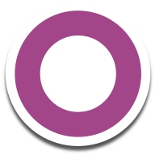

<!--
## Hi there 👋
**imenemedjaoui/imenemedjaoui** is a ✨ _special_ ✨ repository because its `README.md` (this file) appears on your GitHub profile.

Here are some ideas to get you started:

- 🔭 I’m currently working on ...
- 🌱 I’m currently learning ...
- 👯 I’m looking to collaborate on ...
- 🤔 I’m looking for help with ...
- 💬 Ask me about ...
- 📫 How to reach me: ...
- 😄 Pronouns: ...
- ⚡ Fun fact: ...
-->
# Hello, I'm Imène MEDJAOUI

**Full-Stack Developer · Software Engineer · AI Crafter**

---

### 👩‍💻 About Me  
- 💻 Full-stack developer with 4 years of experience in web, Android, and backend development.  
- 🛠️ Skilled in Python, Django, REST APIs, SQL databases, and Odoo 17 custom modules.  
- 🔧 Comfortable with system setups on Windows & Ubuntu, plus integrations like Nextcloud and OnlyOffice.  
- 🎨 Also enjoy digital art and small side projects.  
- 🚀 Curious, adaptable, and always improving.

---

### 🤝 Connect With Me  

  
  <!--  -->
  
  
  <!--  -->

---

### 🛠️ Tech Stack  

  <!-- Frontend -->
  

  <!-- Backend -->
  

  <!-- Databases -->
  
  
  

  <!-- Versioning -->
  

  <!-- Systems -->
  

  <!-- Extra -->
  
  
  
  

---

### 📊 GitHub Stats  

  
  

---

✨ *Thanks for stopping by — check out my repos and feel free to reach out for collaboration or exchange of ideas.*
